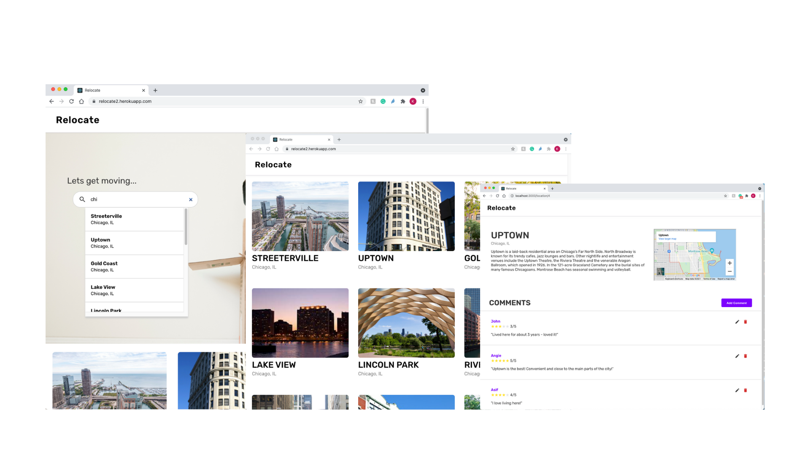
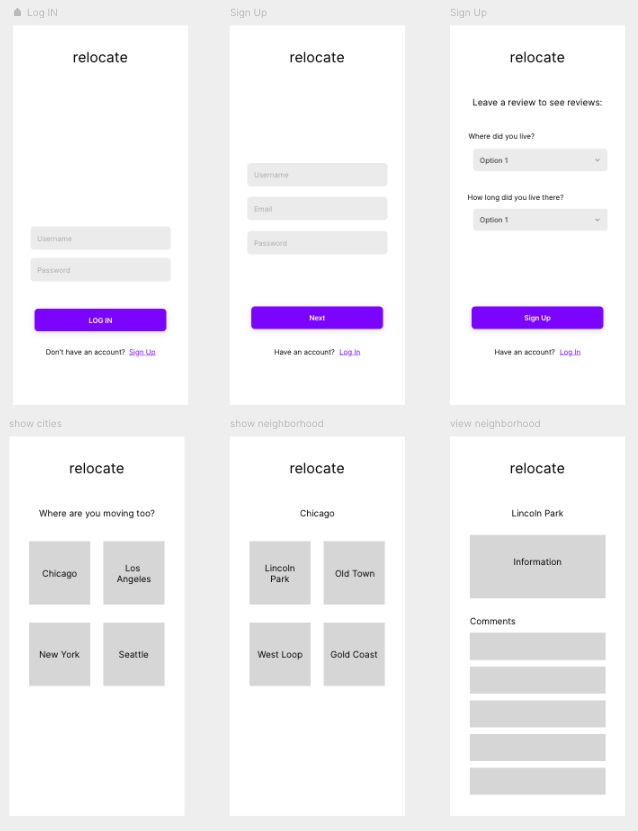

# Relocate

#### By Kacie Komoto

## About Relocate
Relocate is designed to help those moving to a new city decide on which neighborhood they may want to live in by reading comments from the people who live there. This could provide relocators with information about safety, school district, cleaniless, convenience, and overall lifestyle in each neighborhood.

#### Check it out here: [Relocate](https://relocate2.herokuapp.com/)
**this app is deployed on heroku and may take time to load

### Languages & Frameworks Used
- React
- JavaScript
- CSS3
- Django
- Python

## Feature Highlights
- Two Models: Locations and Comments
- React Frontend that communicates RESTfully with Django Backend API to make Comments CRUDable
- Search Bar that allows user to search by neighborhood, city, or state
- Google Map API (Embedded Map)

## Wireframes

## User Stories
- As the user, I want to see a list of all the different neighborhoods
- As the user, I want to see a map of the area
- As the user, I want to see a brief description of the neighborhood
- As the user, I want to see comments and reviews on the neighborhoods
- As the user, I want to be able to search for a specific location

## Major Hurdles
#### 1. Working with two interconnected models when creating CRUDability
Working with two models that were related to eachother, I had to pay special attention to how each were being passed between components, espcially nested ones.

#### 2. Making changes after Heroku Deployment
After deploying to Heroku, my React frontend deployment took a lot longer to update after pushing new changes. Thus, making it more difficult to test my code as I implemented more features.

## Ideas for Future Modifications
1. User Authentication
2. Allow users to provide more information when commenting. 
    For example:
    - Upload pictures
    - State if they lived in location they're commenting on and how long they lived there for
    - Timestamp of when that was commented
3. Add ability to like/bookmark locations
4. Add more information about the location
    For example:
    - Walkscore
    - Safety Rating
    - School District
5. Allow more ways for the user to filter and sort list of locations
    For example:
    - Sort by (most commented on, highest rated, a-z...etc)
    - Filter by Location (All, Chicago, Los Angeles...etc)
6. Improve UX/UI Elements and Usability Testing